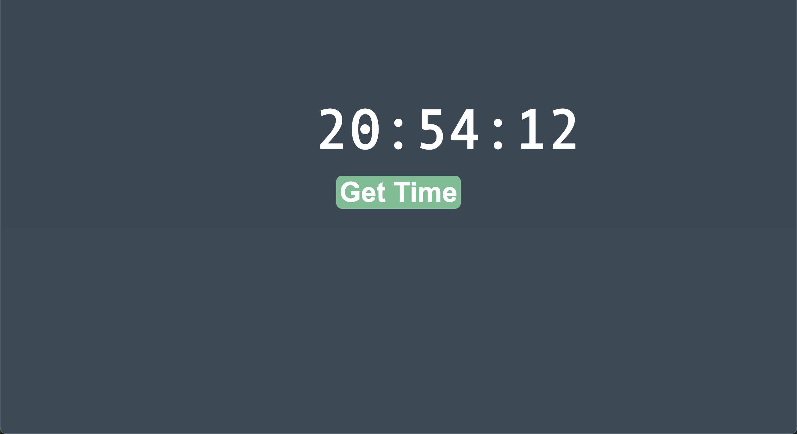

# Appbrewery - React Clock Solution

This is a solution to the React Clock Project from Appbrewery.com

## Table of contents

- [Overview](#overview)
  - [The challenge](#the-challenge)
  - [Screenshot](#screenshot)
  - [Live site](#livesite)
- [My process](#my-process)
  - [Built with](#built-with)
  - [What I learned](#what-i-learned)
- [Author](#author)

## Overview

### The challenge

Users should be able to:

- Understand useState Hook in React
- Show the latest time when the Get Time button is pressed.
- User can get code to be called every second using the setInterval method.
  e.g.

//function sayHi() {
//console.log("Hey");
//}
//setInterval(sayHi, 1000);

### Screenshot

### Live site URL :

https://sanjayvjacob.github.io/digital-clock-react-1/

## My process

### Built with

- Semantic HTML5 markup
- CSS custom properties
- JavaScript
- React JS

### What I learned

Using useState Hook to add state to functional components. It allows you to declare state variables in your component and provides a way to update them.

## Author

- Twitter - [@sanjayvjacob](https://www.twitter.com/sanjayvjacob)
